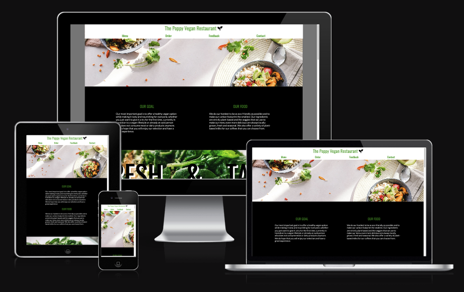

# The Poppy Vegan Restaurant

The Poppy Vegan Restaurant website is a page for people looking for a place to eat at. It offers a plant-based option for people who want to try vegan food, or only consume dairy-free products and no meat.

 Visitors of this website will be able to find a short introduction as to what and how things are done in this restaurant. Inclined to be sustainable, the page draws attention to the fact, that the owners opt to run the restaurant as eco-friendly as they possibly can. There are further information about the menu the restaurant offers, which consist of brunch, meals and coffees with their pricing. Scrolling down the page will get the users to a third section that tells them their options for ordering from the restaurant. Two hyperlinks presented as images will take them to their corresponding websites while opening a new browser tab. The fourth section shows a form that serves as an option for people to leave feedback regarding their experience. A name, an email address and a textarea are provided and they all require their correct input type from the user to be able to submit. The last section is for information about the operating hours of the restaruant, the options for getting in touch and the address (a real address, that belongs to a real restaurant)

## Features

### Navigation
 * The navigation bar is fixed at the top with the name of the restaurant, that serves as a logo for the website. Clicking the logo will take the user to the top of the page instead of reloading
 * Each navigation link will take the user to their corresponding sections of the page and gives a clear instruction as to where the user will be taken once clicked
 * The navigation bar is colored white in order to be able to distuingish it from the other parts of the page when scrolling down

## Short introduction of the page
 * Two articles are located beneath the landing image that tell the user what the restaurant is trying to achieve and how they make that possible
 * These two articles ensure the user that the restaurant only uses vegan ingredients, so they do not have to worry

### Image sections

* Two image sections can be found inbetween 3 sections troughout the page that serve as decoration with some text written over the background that is easy to read
* Their purpose is to give the user an idea of the quality of the products that the restaurant offers

### Menu

* The restaurant menu can be found right after the first image section
* This section serves as a selection of meals and coffees that are available with their pricing shown

The next section that follows is the second image section mentioned above. Ater the second image section comes the order and delivery section.

### Order and delivery

* This section ensures the user that they are able to order from the restaurant, and to do that there are two options that they can choose from
* A small caption lets the user know that the owners are working with delivery companies that are not harmful to their environment in the way of they are operating

### The feedback form

* This serves as a possibility for the user to leave a feedback on their experience with the restaurant whether it was good or bad

* The form collects the guest's or user's full name, their email address, and a note left by them that describes how they feel about the restaurant. All fields are required to submit

### Contact section

* This section holds information about the operating hours, which is different on weekends and weekdays. 
* It also gives information about the phone number and email address of the restaurant
* Furthermore, it shows the address of the restaurant with an embedded google maps iframe. (the actual address shown is the location of a real restaurant that has nothing to do with the restaurant the webpage is about, the purpose of the location and map given is to match the information and for studying purposes)

* Lastly there is a footer located at the bottom of the page that holds hyperlinks to different social media platforms in relation with the restaurant. All the hyperlinks open in a new browser tab.

## Testing

* I have tested that the page works in Google Chrome browser and Safari browser.

* I have confirmed that site is responsive, easy to read, looks decent and works well on standard screensizes using the devtools device in the browser tab.

* I have confirmed that the navigation bar links indeed takes the user to the right and corresponding section of the page, making sure that the fixed navigation bar does not end up hiding content.

* I have confirmed that the feedback form works, and requires entries to submit.

## Unfixed Bugs

* I have noted only one bug troughout making the project. Originally I wanted to include a Tripadvisor icon working as a hyperlink to the Tripadvisor page of the website, but I was unable to do so, because the font-awesome icon belonged to a previous version of fontawesome.

* After learning that it belongs to a previous version, I tried to embed the right script, but the icon displayed as an uknown character (Image provided below) on the page, hence I chose to include Twitter instead.

 

 ## Validator testing

* HTML
    * No errors were returned after using the official W3C html validator

* CSS
    * No errors were returned after using the official W3C CSS Jigsaw validator

## Accessibility

 * The lighthouse extension returned a satisfactory score, however I have had to reduce the size of the images I have used, to make the website load faster.

  

## Deployment

  The website was deployed to GitHub pages, with the followings steps

  1. in the GitHub repository, navigate to settings tab with the gear icon
  2. From the menu located on the left-hand side, select the Pages option
  3. Under the branch drop-down menu, select main, then press save
  4. Once saved, the page provided the link to the completed and live website.

  The live link can be found here: [The Poppy Vegan Restauran](https://gaborficsor.github.io/the-poppy-vegan-restuarant/)

## Credits

  * The code to make the social media link section at the bottom of the page (completed with aria-label description) was inspired by the Love Running Project of Code Institute.

  * The styling for the feedback form was inspired by the styling of the Sign-up form of the Love Running Project of Code Institute.

## Media

  * The photos used as backgrounds of the sections were taken from [Pexels](https://www.pexels.com/).
  * The images used at order section were taken from Google Pictures, and they belong to [Deliveroo](https://deliveroo.ie/) and [Just-Eat](https://www.just-eat.ie/) delivery companies.
  * The icons in the header and footer sections were taken from [Font Awesome](https://fontawesome.com/)
  * For reducing the sizes of the images used as backgrounds I used [PicResize](https://picresize.com/)